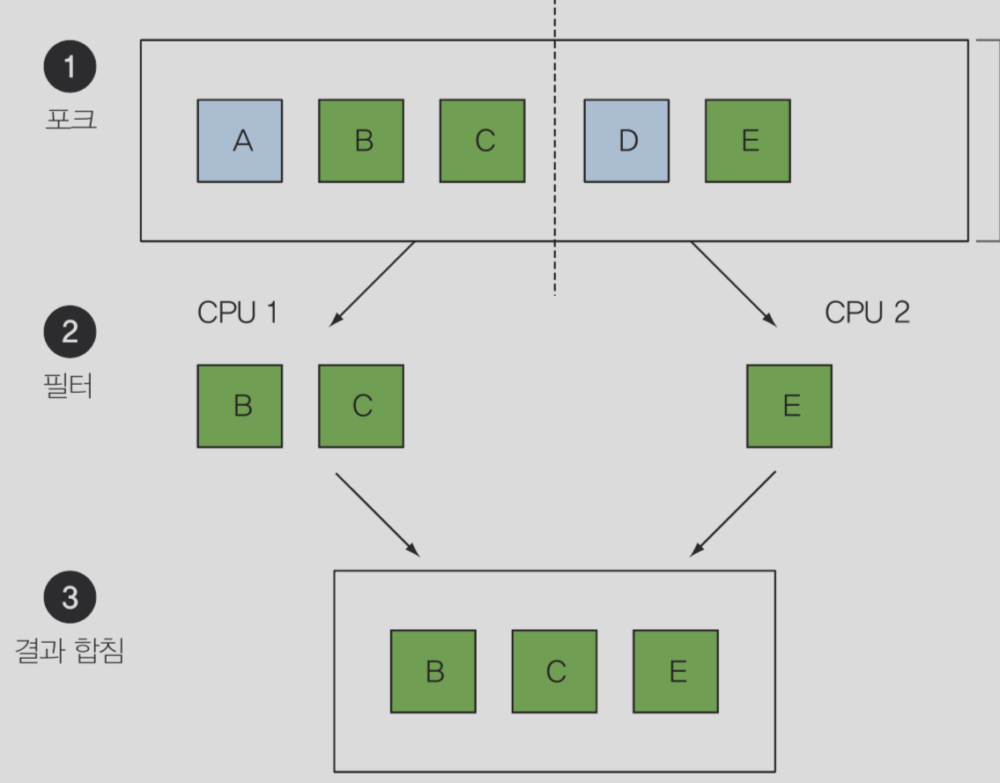

# chapter1. 자바 8 9 10 11 : 무슨 일이 일어나고 있는가?

**자바 8 의 등장 배경과 찬양, 함수형 프로그래밍으로의 한 발**

<br>

## 역사의 흐름은?

- 자바8
    - 자바 역사 중 가장 큰 변화
    - 간결한 코드, 자연어에 가깝게 구현 가능
    - 배경
        - 멀티코어 CPU 의 대중화
        - 병렬 스레드 관리를 편리하게 해야할 필요성 -> 자바8, 9의 RxJava
    - 새로운 개념 등장
        1. stream api
            - 병렬 데이터 표현, 유연한 병렬 연산 지원
        2. method 에 코드 전달(method 참조 & lambda) -> 동작 파라미터화 구현 가능
        3. interface 의 default method

        => 함수형 프로그래밍의 세계에 자바가 발담구기 시작!


<br>
<br>

## 자바가 계속 변하는 이유?

- 진화하지 않는 언어는 죽음
- 캡슐화 + write once run anywhere -> OOP 의 정석으로 시작
- 빅데이터의 등장으로 싱글코어로는 버티기 힘들었고, 멀티코어/병렬성/클러스터의 필요성 등장
- 멀티코어 병렬성을 제공하는 자바8 개발


<br>
<br>

## 자바8 의 새로운 개념 : Stream API

- stream?
    - 한 번에 한개씩 입력되고, 출력되는 **연속적 데이터**들의 모임 like unix command
- Java8 Stream API
    - 병렬 연산을 고수준 추상화해서 멀티 코어에 쉽게 할당
- Collection 을 연산할때 활용 가능
    - Collection
        - 어떻게 데이터를 저장하고 접근할지 중점
        - 엄청 많은 데이터 컬렉션이라면 N의 반복문을 돌때 시간오래걸림 == 멀티코어 활용 어려움
    - java8 이전의 외부 반복을 stream api 를 이용해 내부 반복으로 변환
        - 데이터에 대한 연산을 묘사하는것에 중점

<br>

```java
Map<String, Integer> map = data.stream()
.filter((Data data)-> data.getNum()>30)
.collect(Collectors.groupingBy(Data::getName));
```

<br>

- 스트림 내 요소를 쉽게 병렬로 처리할 수 있는 환경 제공



<br>
<br>

## 자바8 의 새로운 개념 : 동작 파라미터화(메서드에 코드 넘기기)

- 동작 파라미터화
    - 연산동작(method)를 파라미터로 넘길 수 있다.

- 자바8 이전

```java
Collections.sort(data, new Comparator<Data>(){
    public int compare(Data d1, Data d2){
        return d1.getNum().compareTo(d2.getNum());
    }
});
```

- 자바8 이후
```java
Collections.sort(data, Comparator.comparing(Data::getNum)); //동작 파라미터화

data.stream().sorted(Data::getNum).collect(Collectors.toList());
```

<br>
<br>

## 자바8 의 새로운 개념 : 병렬성, 공유 가변 데이터

- 병렬 프로그래밍 -> 공유자원이 안전해야함
    - 자바8 이전 : `synchronized`
    - 자바8 이후 : 순수함수 == 부작용없는 함수 == stateless 함수 추구
        - no shared mutual data
        - 함수형 프로그래밍 핵심 개념 (1급 시민 함수? 머시기)


<br>
<br>

## 자바8 의 새로운 개념 : 함수를 값으로 취급. method/lambda 를 1급 시민으로

- 프로그래밍 언어의 핵심 : **값 == 일급 시민**을 바꾸는 것
- 자바의 전통적 1급 시민
    - primitive type
    - instance

- 자바의 전통적 2급 시민(전달 할 수 없는 값)
    - method
    - class

- 자바8 에서 2급 시민들을 1급 시민으로 올림 by method 참조
    - method 참조 == 이 method를 값으로 사용해라 == 동작 파라미터화
    - lambda == 익명 함수도 1급 값으로 취급
        - lambda 쓰는 이유  : 한번만 쓸 간단한 함수를 따로 정의해주지 않으려고 for 짧고 간결

<br>
<br>

## 자바8의 새로운 개념 : 디폴트 메서드

- 자바8 이전
    - 인터페이스를 변경하면 모든 클래스의 구현을 바꿔야했음 -> 변화에 대응하기 어려움
    
```java
List<Data> dataList = new ArrayList<>();
dataList.sort() //sort() 를 추가하려면?
```

- 자바8 이후
    - 인터페이스를 쉽게 바꿀수 있는 default method 지원 like 추상클래스 구현된 메소드

```java
List<Data> dataList = new ArrayList<>();
dataList.sort() //sort() 를 추가하려면?

interface List {
    default void sort(){
        Collections.sort(this);
    }
}
```

<br>
<br>

## 자바8 패러다임 정리

- 함수형 프로그래밍
- method/lambda 1급 시민으로 사용
- 가변 공유 상태가 없는 == stateless 병렬 실행을 활용 -> 효율적/안전한 함수 호출
- Optional..
