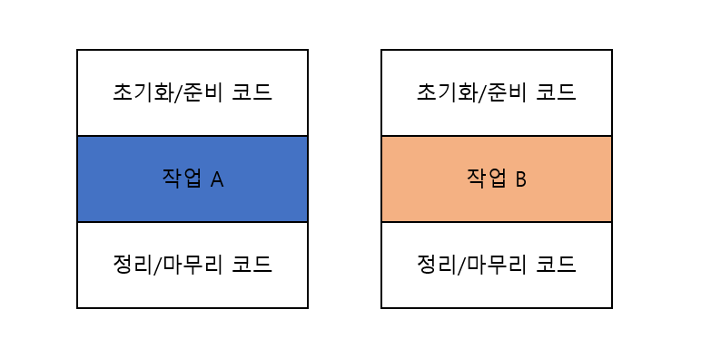

# chapter3. 람다 표현식


## 람다표현식

익명 클래스처럼 이름이 없는 함수면서 메서드를 인수로 전달 가능. 람다 표현식이 익명클래스와 비슷?

### 특징

- 익명 → 보통의 메서드와 달리 이름이 없으므로
- 함수 → 메서드처럼 특정 클래스에 종속되지 않으므로
- 전달 → 람다표현식을 인수로 전달하거나 변수 저장 가능
- 간결성

### 구성

```java
//람다 파라미터         화살표            람다바디
(Apple a1, Apple a2) -> a1.getWeight().compareTo(s2.getWeight));
```

### 스타일

- 표현식 → `(parameters) -> expression`
- 블록 →  `(parameters) -> {statements};`

### 람다의 사용처?

- 함수형 인터페이스
2장에서 사용된 `Predicate<T>`가 바로 **함수형 인터페이스!** 정확히 하나의 추상 메서드를 지정하는 인터페이스 (ex. Comparator, Runnable)
* @FunctionalInterface : 함수형 인터페이스임을 나타내는 어노테이션
- 함수 디스크립터
함수형 인터페이스의 추상 메서드 시그니처는 람다 표현식의 시그니처를 가리킴
람다 표현식의 시그니처를 기술하는 메서드를 함수 디스크립터라고 함

### 실행 어라운드 패턴


```java
public String processFile() throws IOException {
  try (BufferedReader br = new BufferReader(new FileReader("data.txt"))) {
    return br.readline(); //실제 필요한 작업 행
  }
}

// 1단계 processFile의 동작을 파라미터화
String result = processFile((BufferedReader br) -> br.readline() + br.readline());

// 2단계 함수형 인터페이스로 동작 전달
@FunctionalInterface
public interface BufferedReaderProcessor {
  String process(BufferedReader b) throws IOException;
}
public String processFile(BufferedReaderProcessor p) throws IOException {
	...
}

// 3단계 동작 실행
public String processFile(BufferedReaderProcessor p) throws IOException {
  try (BufferedReader br = new BufferedReader(new fileReader("data.txt"))) {
    return p.process(br); // BufferedReader 객체 처리
  }
}

// 4단계 람다 전달
String oneLine = processFile((BufferedReader br) -> br.readline());
String twoLines = processFile((BufferedReader br) -> br.readline() + br.readline());
```

### 함수형 인터페이스 사용

자바 API는 Comparable, Runnable, Callable 등 다양한 함수형 인터페이스를 포함하고 있음

자바8은 `java.util.function` 패키지로 새로운 함수형 인터페이스 제공

- Predicate<T>
    - test라는 추상 메서드를 정의하며, test는 제네릭 형식 T의 객체를 인수로 받아 불리언을 반환

```java
@FunctionalInterface
public interface Predicate<T> {
    boolean test(T t);
}

public<T> List<T> filter(List<T> list, Predicate<T> p) {
    List<T> results = new ArrayList<>();
    for(T t : list) {
        if(p.test(t)) {
            results.add(t);
        }
    }
    return results;
}

Predicate<String> nonEmptyStringPredicate = (String s) -> !s.isEmpty();
List<String> nonEmpty = filter(listOfStrings, nonEmptyStringPredicate);
```

- Consumer<T>
    - accept라는 추상 메서드를 정의하며, 제네릭 형식 T의 객체를 인수로 받아 어떤 동작을 수행

```java
@FunctionalInterface
public interface Consumer<T> {
    void accept(T t);
}

public<T> void forEach(List<T> list, Consumer<T> c) {
    for(T t : list) {
        c.accept(t);
    }
}

forEach(Arrays.asList(1,2,3,4,5), (Integer i) -> System.out.println(i));
```

- Function<T, R>
    - 제네릭 형식 T를 인수로 받아서 제네릭 형식 R 객체를 반환하는 추상 메서드 apply를 정의

```java
@FunctionalInterface
public interface Function<T, R> {
    R apply(T t);
}

public<T, R> List<R> map(List<T> list, Function<T, R> f) {
    List<R> result = new ArrayList<>();
    for(T t : list) {
        result.add(f.apply(t));
    }
    return result;
}

//[7,2,6]
List<Integer> l = map(
    Arrays.asList("lambdas", "in", "action"),
    (String s) -> s.length()
);
```

이외에도 Supplier<T>, UnaryOperator<T>, BinaryOperator<T>, BiPredicate<L, R>, BiConsumer<T, U>, BiFunction<T, U, R>….. 초면이네요….

- 기본형 특화
    - 위 코드들은 제네릭 함수형 인터페이스
    - 자바8은 기본형을 입출력으로 사용하는 상황에서 **오토박싱**을 피할 수 있도록 기본형 특화 인터페이스 제공
    
    ```java
    public interface IntPredicate {
      boolean test(int t);
    }
    
    IntPredicate evenNumbers = (int i) -> i % 2 == 0;
    evenNumbes.test(1000); // 참(박싱x)
    
    Predicate<Integer> oddNumbers = (integer i) -> i % 2 != 0;
    oddNumbes.test(1000); // 거짓(박싱o)
    ```
    

### 형식 검사, 형식 추론, 제약

- 람다 표현식의 형식을 **대상 형식**이라고 함
- 같은 람다 표현식이라도 호환되는 추상 메서드를 가진 다른 함수형 인터페이스로 사용될 가능성 → 대상형식을 명확히
- 콘텍스트를 이용해 람다 표현식과 관련된 함수형 인터페이스 추론
- 람다 표현식에서 자유변수를 활용 → 람다 캡처링
* 자바 구현에서 원래 변수에 접근 X 자유 지역변수의 복사본을 제공하는 것 따라서 지역변수는 한번만 할당 → final

### 메서드 참조

```java
// 기존
inventory.sort((Apple a1, Apple a2) -> a1.getWeight().compareTo(a2.getWeight()));
// 메서드 참조
inventory.sort(Comparing(Apple::getWeight));
```

람다의 축약형!

- 메서드 참조를 만드는 방법

```java
// 정적 메소드 참조
Function<String, Integer> stringToInteger = Integer::parseInt;
// 다양한 형식의 인스턴스 메서드 참조
(String s) -> s.toUpperCase()
String::toUpperCase
// 기존 객체의 인스턴스 메서드 참조
() -> expensiveTransaction.getValue()
expensiveTransaction::getValue
```

### 그리고 다시 🍎…

```java
// sort 메서드에 정렬 전달
void sort(Comparator<? super E> c)

// 사과 비교
public class AppleComparator implements Comparator<Apple> {
  public int compare(Apple a1, Apple a2) {
    return a1.getWeight().compareTo(a2.getWeight());
  }
}

inventory.sort(new AppleComparator());

// 한번만 사용할거면 익명 클래스
inventory.sort(new Comparator<Apple>() {
  public int compare(Apple a1, Apple a2) {
    return a1.getWeight().compareTo(a2.getWeight());
  }
}

// 람다 표현식
inventory.sort((Apple a1, Apple a2) -> a1.getWeight().compareTo(a2.getWeight()));

// 한번 더 줄이고
inventory.sort((a1, a2) -> a1.getWeight().compareTo(a2.getWeight()));

// comparing 메서드를 활용해서
Comparator<Apple> c = Comparator.comparing((apple a) -> a.getWeight());

// 이렇게....
import static java.util.Compartor.comparing;
inventory.sort(comparing(apple -> apple.getWeight());

// 메서드 참조 활용
inventory.sort(comparing(Apple::getWeight));
```

### 디폴트 메서드

- 디폴트 메서드를 활용해서 여러 람다 조합해서 더 복잡하게
- reverse, negate, and, or, andThen, compose…

## 요약

- 람다 표현식은 익명 함수의 일종
- 함수형 인터페이스에서 람다 표현식 사용 가능, 자바8은 다양한 함수형 인터페이스 및 기본형 특화 인터페이스도 제공
- 실행 어라운드 패턴, 메서드 참조 등 사용해서 재사용성 추가
- 람다를 조립할 수 있는 다양한 디폴트 메서드 활용