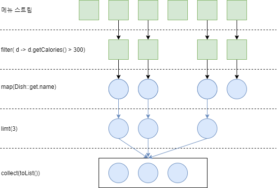

# chapter4. 스트림 소개

**✔ 이 장의 내용**
> * 스트림이 무엇인지  
> * 컬렉션과 스트림  
> * 내부 반복과 외부 반복
> * 중간 연산과 최종 연산

## 스트림이란?
* 자바8 api에 새로 추가된 기능
* 선언형으로 컬렉션 데이터를 처리 가능하다
* 멀티 스레드 코드를 구현하지 않아도 데이터를 **투명하게** 병렬 처리할 수 있다
* 코드에서 `stream()`을 `paralleStream()`으로 변경하면 멀티코어 아키텍처에서 병렬로 실행할 수 있다
* 데이터 처리 연산을 지원하도록 소스에서 추출된 연속된 요소

## 스트림 시작하기
~~~java
List<String> treeHighCaloricDishesName = 
  menu.stream() // 메뉴에서 스트림을 얻는다.
    .filter(d -> d.getCalories() > 300) // 고칼로리 요리 필터링 (특정 요소 제외)
    .map(Dish::getName) // 요리명 추출 (람다를 이용하여 다른 요소로 변환or정보추출)
    .limit(3) // 선착순 세 개만 선택 (크기 축소)
    .collect(toList()); // 결과를 다른 리스트로 저장 (스트림을 다른 형식으로 변환)
~~~
* 연속된 요소: 특정 요소 형식으로 이루어진 연속도니 값 집합의 인터페이스 제공
* 소스(데이터 소스): 데이터 제공 소스(컬렉션, 배열, I/O자원)로부터 데이터를 소비  
  정렬된 컬렉션으로 스트림을 생성하면 정렬이 그대로 유지  
  => 요리 리스트
* 데이터 처리 연산: 데이터베이스와 비슷한 연산 지원, 순차적 or 병렬로 실행
  => filter, limit, collect

### 스트림의 특징
#### 1. **선언형**으로 코드를 구현할 수 있다  
`loop`, `if` 등의 제어블록없이 동작의 수행을 지정할 수 있음 => 요구 사항에 쉽게 대응
#### 2. **복잡한 데이터 처리 파이프 라인**을 만들 수 있다  
* `filter, sorted, map, collect` 같은 빌딩 블록 연산을 연결해서 파이프 라인 생성 
* 위의 연산은 **고수준 빌딩 블록**으로 특정 스레딩 모델에 제한되지 않고 자유롭게 사용 가능하다
* **가독성 + 명확성**이 유지된다
* 데이터처리를 **병렬화**하면서 스**레드 + 락을 걱정하지 않아도 된다**
* 게으름(laziness), 쇼트서킷(short-circuiting)같은 최적화를 얻을수 있다
### 3. 딱 한번만 탐색할 수 있다
탐색된 스트림의 요소는 소비된다
~~~java
List<String> names = Arrays.asList("Java8", "Lambdas", "In", "Action");
Stream<String> s = names.stream();
s.forEach(System.out::println); // 타이틀의 각 단어를 출력
s.forEach(System.out::println); // 스트림이 이미 소비되었거나 닫힘, IllegalStateException 발생!
~~~
### 4. 내부 반복
* 외부반복
  * for-each 등 사용자가 직접 요소를 반복해야함
* 내부반복
  * 반복을 알아서 처리하고 결과 스트림값을 어딘가에 저장함  
  * 작업을 투명하게 병렬로 처리 가능함  
  * 더 최적화된 다양한 순서로 처리할 수 있음
~~~java
// 반복자 없이 파이프라인을 실행한다 => 내부반복
List<String> names = menu.stream()
        .map(Dish::getName())
        .collect(toList()); 
~~~
 

**+) 자바8이전 컬렉션을 제어하는 라이브러리**
* 구아바, 아파치, 람다제이
* 자바8 덕분에 선언형으로 컬렉션을 제어하는 공식 라이브러리가 생김

## 스트림 연산
### 중간연산 : 연결할 수 있는 스트림 연산
* filter, sorted, limit, map, distinct ..
* 여러 중간 연산을 연결해서 질의를 생성함
* 스트림 파이프라인에 실행하기 전까지 아무 연산도 수행하지 않는다 => lazy
* 스트림의 lazy한 특징 덕분에 **쇼트서킷**, **루프퓨전** 같은 최적화 효과를 얻을 수 있다.

### 최종연산 : 스트림을 닫는 연산
* collect, forEach, count
* 스트림 파이프라인에서 결과를 도출함