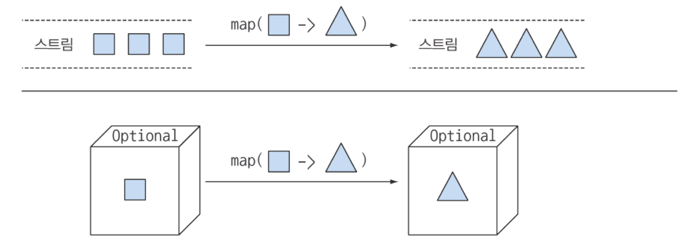
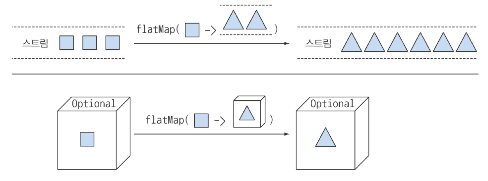

# chapter11.null 대신 Optional 클래스

> 자바8에서는 값이 있거나 없을 수 있음을 표현하는 java.Util.Optional&lt;T&gt;를 제공    
> 팩토리 메서드를 이용해 Optional 객체 만들 수 있음    
> Optional로 예상치 못한 null 예외 방지 가능 → 이는 더 좋은 API 설계로


### 값이 없는 상황에서

- 다양한 null 확인 코드 추가
- 변수 접근마다 중첩 if 등을 쓰며 코드 들여쓰기 증가(깊은 의심)
- 중첩 if를 없애더라도 너무 많은 출구로 유지보수 어려움

### null 때문에

- 에러의 근원
- 어지러운 코드
- 의미 없음
- 자바 철학에 위배
- 형식 시스템에 구멍

## Optional 클래스 소개

Optional이란 선택형값을 캡슐화하는 클래스

값이 있으면 Optional 클래스는 값을 감싸지만 값이 없으면 Optional.empty 메서드로 Optional을 반환

```java
public class Person {
    private Optional<Car> car;

    public Optional<Car> getCar() {
        return car;
    }
}

public class Car {
    private Optional<Insurance> insurance;

    public Optional<Insurance> getInsurance() {
        return insurance;
    }
}

public class Insurance {
  private String name;

  public String getName() {
      return name;
  }
}
```

사람은 자동차를 소유했을 수도 아닐 수도    
자동차는 보험에 가입되었을 수도 아닐 수도    
반면 보험은 반드시 이름을 가짐

## Optional 적용 패턴

### Optional 객체 만들기

```java
// 빈 Optional 객체
Optiona optCar = Optional.empty();

// car가 Null 일 경우 즉시 NPE가 발생
Optional optCar = Optional.of(car)

// car 가 null이면 빈 Optional 객체가 반환
Optional optCar = Optional.ofNullable(car)
```

### 맵으로 Optional의 값을 추출하고 변환하기

```java
Optional<Insurance> optInsurance = Optional.ofNullable(insurance);
Optional<String> name = optInsurance.map(Insurance::getName);
```

스트림의 Map 메서드와 개념적으로 비슷



### flatMap으로 Optional 객체 연결

```java
Optional<Person> optPerson = Optional.of(person);
Optional<String> name = optPerson.map(Person::getCar)
                                 .map(Car::getInsurance)
                                 .map(Insurance::getName);
```

위 코드의 연산 결과는 Optional<Optional<Car>> 형식의 객체로 getInsurance가 지원되지 않아 컴파일 불가    
→ 함수를 인수로 받아 다른 스트림을 반환하는 **flatMap** 이용



```java
public String getCarInsuranceName(Optional<Person> person) {
  return = person.flatMap(Person::getCar)
    .flatMap(car::getInsurance)
    .map(Insurance::getName)
    .orElse("Unknown"); // 결과 Optional이 빈 경우 기본값
}
```

❗️도메인 모델에 Optional을 사용했을 때 직렬화 불가

Optional은 필드 형식으로 사용할 것을 가정하지 않아 Serializable 인터페이스를 구현하지 않음    
따라서 도메인 모델에 적용할 시 직렬화 모델을 사용하는 도구나 프레임워크에서 문제 발생 가능    
그럼에도 도메인 모델 구성 시 사용하는 것이 바람직하다고 생각

```java
public class Person {
  private Car car;
  public Optional<Car> getCarAsOptional() {
    return Optional.ofNullable(car);
  }
}
```

### Optional 스트림 조작

자바9에서는 Optional에 Stream() 메서드 추가

```java
public Set<String> getCarInsuranceNames(List<Person> persons) {
  return persons.stream()
    .map(Person::getCar) // Optional<Car> 스트림으로 변환
    .map(optCar -> optCar.flatMap(Car::getInsurance)) // Optional<Insurance>로 변환
    .map(optIns -> OptIns.map(Insurance::getName)) // Optional<String>로 매핑
    .flatMap(Optional::stream) // Stream<String>으로 변환
    .collect(toSet()); // 집합으로 수집
}
```

### 디폴트 액션과 Optional 언랩

Optional 클래스는 Optional 인스턴스에 포함된 값을 읽는 다양한 방법을 제공

- get()은 값을 읽는 가장 간단하면서 가장 안전하지 않은 메서드. 래핑된 값이 있으면 해당 값을 반환하고 없으면 NoSuchElementException을 발생시킴
- orElse(T other) 메서드는 Optional이 값을 포함하지 않을 때 기본 값을 제공
- orElseGet(Supplier<? extends T> other)은 orElse 메서드에 대응하는 게으른 버전의 메서드. Optional에 값이 없을때만 Supplier가 실행. 디폴트 메서드를 만드는데 시간이 걸리거나 Optional이 비어있을 때만 기본값을 생성하고자 할 때 사용
- orElseThrow(Supplier<? extends X> exceptionSupplier)는 Optional이 비어있을때 지정한 예외를 발생
- ifPresent(Consumer<? super T> consumer)는 값이 존재할 때 인수로 넘겨준 동작을 실행
- ifPresentOrElse(Consumer<? super T> action, Runnable emptyAction)은 Optional이 비어있을 때만 실행할 수 있는 Runnable을 인수로 받음(자바9)

### 두 Optional 합치기

```java
public Insurance findCheapestInsurance(Person person, Car car) {
  // 보험회사 서비스...
  // 모든 결과 데이터 비교...
  return cheapestCompany;
}

// 1
public Optional<Insurance> nullSafeFindCheapestInsurance(
    Optional<Person> person, Optional<Car> car) {
  if (person.isPresent() && car.isPresent()) {
    return Optional.of(findCheapestInsurance(person.get(), car.get()));
  } else {
    return Optional.empty();
  }
}

// 2
// 퀴즈 정답
public Optional<Insutrance> nullSafeFindCheapestInsurance(
    Optional<Person> person, Optional<Car> car) {
  return person.flatMap( p -> car.map( c -> findCheapestInsurance(p, c)));
}
```

- 1의 코드는 person과 car의 시그니처만으로 둘 다 아무 값도 반환하지 않을 수 있다는 정보를 명시적으로 보여주지만, 구현 코드는 null 확인 코드와 크게 다르지 않음
- 2처럼 한 줄의 코드로 메서드 재구현 가능

### 필터로 특정값 거르기

```java
Insurance insurance = ...;
if(insurance != null && "CambridgeInsurance".equals(insurance.getName())){
  System.out.println("OK");
}

// 필터 메서드 활용해 재구현
Optional<Insurance> optInsurance = ...;
optInsurance.filter(insurance -> "CambridgeInsurance".equals(insurance.getName()))
  .ifPresent(x -> System.out.println("OK"));
```

## Optional을 사용한 실용 예제

- 잠재적으로 null이 될 수 있는 대상을 Optional로 감싸기
- 기존에 null 체크할 때는 if문으로 확인했지만 예외 발생 메서드는 try/catch문 사용
- 스트림과 같이 기본형 특화된 `OptionalInt`, `OptionalLong`, `OptionalDouble` 등 제공, 그러나 Optional의 최대 요소 수는 한 개이므로 기본형 특화 클래스로 성능 개선은 X
