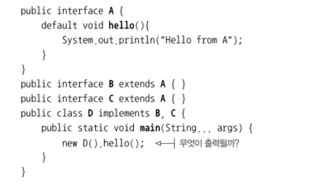

# chapter13. 디폴트 메서드
## 인터페이스 설계자가 기존 인터페이스에 메서드를 추가하고 싶다면?
- 모든 개발자가 해당 인터페이스를 구현했던 모든 자식클래스를 수정해줘야함
- 해결방법
    - 인터페이스 내부에 정적메서드 사용
    - 디폴트메서드 사용
        - 자바8 이후 메서드 구현을 포함하는 인터페이스를 정의할 수 있게됨 
- 효과
    - 자바 API 의 호환성을 유지하면서 라이브러리를 바꿀 수 있게됨
    - 다중 상속 동작이라는 유연성도 제공
```java
//List interface
default void sort(Comparator<? super E> c){
    Collections.sort(this, c);
}
//Collections interface
default void stream(){
    return StreamSupport.stream(sliterator(), false);
}
```
- 그래서 인터페이스와 추상 클래스가 다른 점은?
    - 추상클래스는 하나만 상속 가능, 인터페이스는 여러개 구현 가능
    - 추상 클래스는 필드를 가질 수 있지만 인터페이스는 불가능


## 변화하는 API
- 자바 8 이전에 기존 API 를 바꾸는게 어려운 이유?
    - 기존 버전과의 호환성 문제
    - 이미 해당 API 를 implements 해서 구현한 클래스에 추가된 메서드를 새로 필수로 구현해줘야함 
    - 구현하지 않아도 바이너리 호환성은 유지되자만 재빌드시 컴파일 에러(==소스호환성은 유지안됨)
- 자바 호환성?
    - 바이너러 호환성
        - 에러없이 기존 바이너리가 실행될 수 있는 상황
    - 소스 호환성
        - 재컴파일이 가능한 상황
    - 동작 호환성
        - 같은 입력값이 주어지면 같은 동작을 실행하는 상황
- 디폴트 메서드 등장 이후
    - 기존 API 에 메서드를 새롭게 추가해도 자동으로 기본 구현을 제공-> 기존 코드를 전혀 고치지 않아도 됨
    - 소스 호환성 유지됨
    - 자바가 다중상속이 가능하게 됨


## 디폴트 메서드 활용 패턴
- 디폴트 메서드 활용 방식
    1. 선택형 메서드
    2. 동작 다중 상속
- 선택형 메서드
    - 인터페이스 내 사용하지 않는 불필요한 메서드를 구현할 필요가 없게 할 수 있음 -> 구현 쪽에서 불필요한 코드 줄일 수 있음
```java
//Iterator interface
default void remove(){
    throw new UnsupportedOperationException();
}
```

- 동작 다중 상속
    - 인터페이스는 여러개를 implements 할 수 있으므로 다양한 인터페이스의 기능을 끌어올 수 있음 + 디폴트 메서드의 기본 동작을 상속 받을 수 있음
    
    - 장점
        - 기능이 중복되지 않는 최소의 인터페이스
            - 인터페이스 내 추상 메서드 들을 활용한 디폴트 메서드 제공 가능 like template pattern
        ```java
        interface Movable{
            int getX();
            int getY();
            default String printLocation(){
                return "("+getX()+","+getY()+")";
            }
        }
        ```
        - 인터페이스 조합
            - 여러 기능을 하는 인터페이스를 다중 상속해서 조합할 수 있음
        - 디폴트 메서드를 수정 시 자식 클래스에 모두 자동 상속시킬 수 있음


## 해석규칙

- 상황
    - 여러 인터페이스를 implements 하는데, 같은 시그니처를 갖는 디폴트메서드를 상속받아 구현한다면 런타임에 어떤 디폴트메서드를 사용하게될까?

```java
interface A{
    default void hello(){ System.out.println("A hi"); }
}

interface B implements A{
    default void hello(){ System.out.println("B hi"); }
}

interface C implements B,A{
    void main(){
        new C().hello();
    }
}
```
- 규칙
    - 1순위 : **클래스**
        - 클래스가 인터페이스보다 항상 우선
        - class / super class 에서 정의한 메서드가 디폴트메서드보다 우선
    - 2순위 : **서브인터페이스**
        - 상속하는 class / super class 에 메서드 정의가 없을때 가장 자식인 인터페이스가 우선
        - B가 A 보다 우선
    - 3순위 : 1,2 순위의 경우가 아니라면 사용하는 쪽에서 명시적으로 디폴트메서드를 오버라이드해서 호출해야함
    ```java
    interface C implements B,A{
    void hello(){
        B.super.hello();
    }
    ```

- 다이아몬드 문제


- 결국 선택할 수 있는 디폴트메서드는 한 개
- B 에도 시그니처가 같은 hello() 가 있으면?
- B,C 모두에 시그니처가 같은 hello() 가 있으면?


## 정리
- 자바8부터는 인터페이스에 구현코드까지 정의된 디폴트메서드가 등장 -> 기존 인터페이스에 새로운 메서드를 추가할때 호환성 유지 가능 
