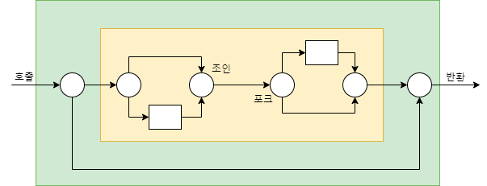
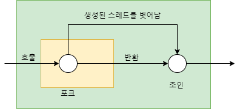
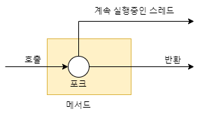
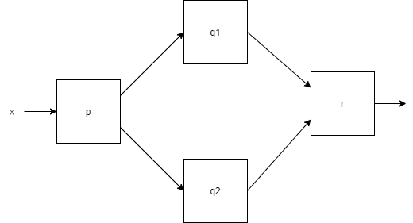

# chapter15. CompletableFuture와 리액티브 프로그래밍 컨셉의 기초


> 자바의 동시성 지원의 발전, 스레드 풀은 유용하지만 블록되는 테스크가 많아지면 문제가 발생    
비동기 메서드는 병렬성 추가 가능 부수적으로 루프를 최적화 할 수 있음    
박스와 채널 모델을 통해 비동기 시스템 시각화 가능    
자바 8 CompletableFuture 과 자바 9 플로 api 모두 박스와 채널 다이어그램으로 표현 가능    
CompletableFuture는 한 번의 비동기 연산을 표현, 콤비네이터 조합을 이용해 기존 future의 블로킹 해결 가능
> 

### 애플리케이션을 어떻게 구성하는가

마이크로서비스 아키텍처 선택이 증가하며 매시업 형태로

여러 웹 서비스에 접근하며 응답을 기다리는 동안 연산이 블록되거나 CPU 사이클 자원을 낭비하지 않도록

이와같은 상황에서 사용 가능한 두 가지 주요 도구 중 하나

## 동시성을 구현하는 자바 지원의 변화

Runnable, Thread `초기` → ExecutorService(Callable<T>, Future<T>, 제네릭) `자바 5` → RecursiveTask `자바 7` → 스트림과 람다 지원에 기반한 병렬 프로세싱 `자바 8`

### Executor와 스레드 풀

- 스레드의 문제
    - 자바 스레드는 직접 운영체제 스레드에 접근
    - 운영체제 스레드를 만들고 종료하는 것은 비용이 들며 숫자도 제한이 있음 → 초과시 예상치 못하게 크래시될 수 있음
- 스레드 풀 그리고 스레드 풀이 더 좋은 이유
    - newFixedThreadPool과 같은 팩토리 메서드를 이용해 스레드 풀 만들어 사용 가능
    - 스레드 풀에서 사용되지 않은 스레드로 제출된 태스크를 순서대로 실행, 종료되면 스레드 풀로 반환
    - 하드웨어에 맞는 수의 태스크를 유지하며 태스크를 스레드 풀에 오버헤드 없이 제출 가능
    - 큐의 크기 조정, 거부 정책, 태스크 종류에 따른 우선순위 변경 등의 설정 가능
- 스레드 풀 그리고 스레드 풀이 나쁜 이유
    - k 스레드를 가진 스레드 풀은 오직 k만큼의 스레드를 동시에 실행할 수 있음
    - sleep 상태이거나 I/O 블록 상황인다면 주의 → 효율성 저하나 데드락
    - main이 반환되기 전에 모든 스레드의 작업이 끝나야 함

### 스레드의 다른 추상화: 중첩되지 않은 메서드 호출

- 7장(병렬 스트림 처리와 포크/조인 프레임워크)에서 설명한 동시성과의 차이..?
    
    7장의 동시성은 태스크나 스레드가 메서드 호출안에서 시작되면 호출을 반환하지 않고 작업 끝을 기다림
    
    → 스레드 생성과 join()이 한 쌍처럼 중첩된 메서드 호출 내에 추가(**엄격한 포크/조인**)

  
    
    시작된 태스크를 외부 호출에서 종료하도록 기다리는 여유로운 방식(**여유로운 포크/조인**)

  
- 
    15장의 동시성은 사용자의 메서드 호출에 의해 스레드가 생성되고 메서드를 벗어나 계속 실행되는 동시성 형태

  
- 
    해당처럼 메서드가 반환된 이후에도 태스크 실행이 계속되는 메서드를 **비동기 메서드**라고 함
    
    - 메서드를 호출한 다음의 코드와 동시에 실행되므로 데이터 경쟁 문제를 일으키지 않도록
    - 기존 스레드가 종료되지 않은 시점에서 main메서드가 반환되면?
        - 애플리케이션을 종료하지 못하고 모든 스레드가 실행을 끝낼 때까지 대기
        - 종료를 방해하는 스레드를 kill하고 애플리케이션 종료
        
        → 두 가지 모두 위험
        

## 동기 API와 비동기 API

```java
int f(int x);
int g(int x);

int y = f(x);
int z = g(x);
System.out.println(y+z);
```

다음과 같은 동기 API 를 호출하고 합하는 코드를 합쳐보자

```java
class ThreadExample {

    public static void main(String[] args) throws InterruptedException {
        int x = 1337;
        Result result = new Result();

        Thread t1 = new Thread(() -> { result.left = f(x); });
        Thread t2 = new Thread(() -> { result.right = g(x); });
        t1.start();
        t2.start();
        t1.join();
        t2.join();
        System.out.println(result.left + result.right);
    }

    private static class Result {
        private int left;
        private int right;
    }
}
```

f와 g를 실행하는데 시간이 오래 걸린다고 가정할 때 별도의 CPU 코어로 실행하도록 변경하여 둘 중 오래 걸리는 작업의 시간으로 합계 구하는 시간을 단축할 수 있음

그러나 복잡하게 변함

```java
public class ExecutorServiceExample {

    public static void main(String[] args) throws ExecutionException, InterruptedException {
        int x = 1337;

        ExecutorService executorService = Executors.newFixedThreadPool(2);
        Future<Integer> y = executorService.submit(() -> f(x));
        Future<Integer> z = executorService.submit(() -> g(x));
        System.out.println(y.get() + z.get());

        executorService.shutdown();
    }
}
```

Runnable 대신 Future API 인터페이스로 단순화(ExecutorService로 스레드 풀 설정했다고 가정)

여전히 명시적인 submit 등의 코드로 오염

⇒ **비동기 API**로 바꿔서 해결

### Future 형식 API

첫번째 대안

```java
Future<Integer> f(int x);
Future<Integer> g(int x);

Future<Integer> y = f(x);
Future<Integer> z = g(x);
System.out.println(y.get() + z.get());
```

- 다른 상황에서는 g에도 Future 형식이 필요할 수 있으므로 API 형식을 통일하는 것이 바람직
- 병렬 하드웨어로 프로그램 속도를 극대화하려면 여러 작은 하지만 합리적인 크기의 태스크로 나누는 것이 좋음

### 리액티브 형식 API

두번째 대안

```java
void f(int x, IntConsumer dealWithResult);

public class callbackStyleExample {
    public static void main(String[] args) {
        int x = 1337;
        Result result = new Result();

        f(x, (int y) -> {
            result.left = y;
            System.out.println(result.left + result.right);
        });

        g(x, (int z) -> {
            result.right = z;
            System.out.println(result.left + result.right);
        });
    }
}
```

f는 바디를 실행하면서 태스크를 만든 다음 즉시 반환

f와 g의 호출 합계를 정확하게 출력하지 않고 상황에 따라 먼저 계산된 결과를 출력

- if-then-else를 이용해 적절하게 락을 사용해 두 콜백이 모두 호출되었는지 확인
- 리액티브 API는 보통 한 결과가 아니라 일련의 이벤트에 반응하도록 설계되어 Future를 사용하는 것이 더 바람직

### 잠자기는 해로운 것으로 간주

```java
// A
work1();
Thread.sleep(10000);
work2();

// B
public class ScheduledExecutorServiceExample {
    public static void main(String[] args) {
        ScheduledExecutorService scheduledExecutorService = Executor.newScheduledThreadPool(1);

        work1();
				// work1이 끝나고 10초 뒤 work2를 개별 태스크로 제출
        scheduledExecutorService.schedule(ScheduledExecutorServiceExample::work2, 10, timeUnit.SECONDS);

        scheduledExecutorService.shutdown();
    }

    public static void work1() {
        System.out.println("Hello from Work1!");
    }

    public static void work2() {
        System.out.println("Hello from Work2!");
    }
}
```

A는 sleep상태인 동안 스레드 자원을 점유하지만 B는 다른 작업이 실행될 수 있도록 허용

- 현실적으로 모든 것은 비동기 라는 설계 원칙을 지킬 수 X, 모든 API를 비동기로 만드는 것을 따지지 말고 개선된 동시성 API를 이용해 볼 것(+ Netty)
- 비동기 API에서의 예외?
    - 비동기 API에서 호출된 메서드의 바디는 별도의 스레드에서 호출되며 어떤 에러는 이미 호출자의 실행 범위와는 관계 없어짐
    - CompletableFuture에서는 get()메서드에 예외 처리 기능을 제공하며 회복 가능하도록 exceptionally() 같은 메서드도 제공(→16장)
    - 리액티브 형식의 비동기 API에서는 return 대신 기존 콜백이 호출되므로 예외 발생시 실행될 추가 콜백을 만들어 인터페이스 변경해야 함

## 박스와 채널 모델



동시성 모델을 설계&개념화한 그림 → 박스와 채널 모델

```java
// 1
int t = p(x);
System.out.println(r(q1(t), q2(t));

// 2
int t = p(x);
Future<integer> a1 = executorService.submit(() -> q1(t));
Future<integer> a2 = executorService.submit(() -> q2(t));
System.out.println(r(a1.get(), a2.get());
```

- 1은 q1, q2를 차례로 호풀하여 하드웨어 병렬성과 거리가 멈
- 2는 future을 활용

```java
System.out.println( r(q1(t), q2(t)) + s(x) );
```

- 다이어그램 모양상 p와 r을 future로 감싸도록, p는 먼저, r은 마지막에
- 위 코드도 거리가 멈
- 병렬성 극대화를 위해 모든 다섯 함수를 future로 감싸야 함

## CompletableFuture와 콤비네이터를 이용한 동시성

- 왜 ComposableFuture가 아닌 CompletableFuture?
    - future를 조합할 수 있는 기능
    - 일반적으로 future는 get()으로 결과를 얻을 수 있는 Callable
    - CompletableFuture는 실행할 코드 없이 future 만들 수 있게 허용하고 complete() 통해 나중에 다른 스레드가 완료, get()으로 값 얻을 수 있도록 허용

```java
public class CFComplete {

    public static void main(String[] args) throws ExecutionException, InterruptedException {
        ExecutorService executorService = Executors.newFiexedthreadPool(10);
        int x = 1337;

        CompletableFuture<Integer> a = new CompletableFuture<>();
        executorService.submit(() -> a.complete(f(x)));
        int b = g(x);
        System.out.println(a.get() + b);

        executorService.shutdown();

    }
}
```

- f(x)의 실행이 끝나지 않았을 때 get()을 기다리며 자원 낭비할 수 있음

```java
ComposableFuture<V> thenCombine(CompletableFuture<U> other, Bifunction<T, U, V> fn)

public class CFComplete {

    public static void main(String[] args) throws ExecutionException, InterruptedException {
        ExecutorService executorService = Executors.newFiexedthreadPool(10);
        int x = 1337;

        CompletableFuture<Integer> a = new CompletableFuture<>();
        CompletableFuture<Integer> b = new CompletableFuture<>();
				// 핵심행
        CompletableFuture<Integer> c = a.thenCombine(b, (y, z) -> y + z);
        executorService.submit(() -> a.complete(f(x)));
        executorService.submit(() -> b.complete(g(x)));

        System.out.println(c.get());
        executorService.shutdown();

    }
}
```

- thenCombine을 이용해 f(x),g(x)가 끝난 다음에 덧셈 계산 실행

## 발행-구독 그리고 리액티브 프로그래밍

- 자바 9에서는 java.util.concurrent.Flow의 인터페이스에 발행-구독 모델을 적용해 리액티브 프로그래밍을 제공(future같은 객체를 통해 여러 결과를 제공)
    - 구독자가 구독할 수 있는 **발행자**
    - 이 연결을 **구독**이라고 함
    - 이 연결을 통해 **메시지**(또는 **이벤트**)를 전송

### 두 플로를 합치는 예제

- 스프레드 시트의 셀에서 제공하는 그런 동작!(=C1+C2)

```java
private class SimpleCell {
    private int value = 0;
    private String name;
    public SimpleCell(String name) {
        this.name = name;
    }
}

SimpleCell c2=new SimpleCell("C2");
SimpleCell c1=new SimpleCell("C1");

// c1과 c2에 이벤트가 발생했을 때 c3을 구독하려면?
interface Publisher<T> {
    void subscribe(Subscriber<? super T> subscriber);
}

interface Subscriber<T> {
    void onNext(T t);
}

public class SimpleCell implements Publisher<Integer>, Subscriber<Integer> {
    private int value = 0;
    private String name;
    private List<Subscriber> subscribers = new ArrayList<>();

    public SimpleCell(String name) {
        this.name = name;
    }

    @Override
    public void subscribe(Flow.Subscriber<? super Integer> subscriber) {
        subscribers.add(subscriber);
    }
		// 새로운 값이 있음을 모든 구독자에게 알리는 메서드
    private void notifyAllSubscribers() {
        subscribers.forEach(subscriber -> subscriber.onNext(this.value));
    }

    @Override
    public void onNext(Integer newValue) {
        this.value = newValue; // 구독한 셀에 새 값이 생겼을 때 값을 갱신해서 반응
        System.out.println(this.name + ":" + this.value)
        notifyAllSubscribers();
    }
}
```

그렇다면 c3=c1+c2를 구현하려면? 연산 결과를 저장할 수 있는 별도의 클래스가 필요

```java
public class ArithmeticCell extends SimpleCell {
    private int left;
    private int right;

    public ArithmeticCell(String name) {
        super(name);
    }

    public void setLeft(int left) {
        this.left = left;
        onNext(left + this.right);
    }

    public void setRight(int right) {
        this.right = right;
        onNext(right + this.left);
    }
}
```

- 데이터가 발행자에서 구독자로 흐름에 착안해 이를 **업스트림** 또는 **다운스트림**이라고 함

### 역압력

- 플로 인터페이스의 개념을 복잡하게 만든 것은 압력과 역압력
    - 압력 : 매 초마다 수천개의 메시지가 onNext로 전달된다면? (결국 과부하와 비슷한 개념인지?)
- 정보의 흐름 속도를 제어하는 역압력 기법 필요