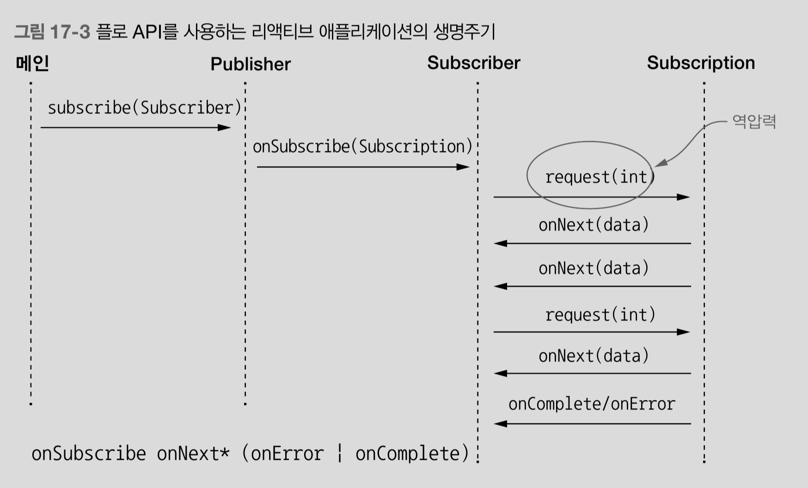

# chapter17. 리액티브 프로그래밍
**RxJava!**

<br>


## 리액티브 프로그래밍 패러다임의 중요성이 증가하는 이유
### 배경
- 페타바이트 단위의 빅데이터를 쌓기 시작
- 모바일, 클러스터 등 다양한 디바이스 위에 올려지는 어플리케이션
- 언제나 어디서나 서비스에 접근할 수 있는 접근성
- 사용자의 빠른 응답에 대한 기대
### Rx 의 필요성 대두
- 다양한 시스템/어플리케이션/소스 에서 들어오는 데이터 스트림을 비동기적으로 처리하고 합치자 
### Rx 에 대한 기대
- 데이터를 바로 처리하는 높은 응답성 제공
- 시스템의 고장에 유연한 가용성 제공

<br>


## 리액티브 매니패스토(Rx 시스템의 개발 핵심 원칙)
- 반응성(responsive)
    - 일관성있고 예상가능한 반응시간 제공 
- 회복성(resilient)
    - 장애가 발생해도 반응하는 시스템
    - 하나가 실패해도 전체 시스템은 계속 운영
    - 방법
        - subscriber, publisher 의 분리-> 독립적이고 비동기적인 프로세스로 실행
- 탄력성(elastic)
    - 다양한 작업 부하로 반응성이 위협받으면 자동으로 서비스의 할당 자원수를 늘린다
- 메세지 driven
    - 느슨한 결합으로 묶인 서비스들은 비동기 메세지로 통신
    - 효과
        - 장애를 메세지로 처리해서 회복성 증가
        - 메세지 수에 따라 적절한 리소스 할당으로 탄력성 증가

<br>


## 애플리케이션 수준의 Rx
- event stream 을 block 하지 않고 비동기로 작업을 수행할 수 있는 기능을 제공하는 rx 라이브러리들 ==> 최신 멀티코어 cpu 의 사용률을 극대화
- 전제
    - main event pool 내 event stream 이 block 되지 않아서 낭비되는 스레드가 없어야 한다.
    - 일반 rx 라이브러리들의 해결 방법
        - 별도 스레드풀에서 block event 를 실행
- 효과
    - 어려운 비동기 애플리케이션 구현의 추상수준을 높일 수 있다 => 비지니스 요구사항에만 집중하면 됨
    - 시간적 비결합

<br>

## 시스템 수준의 Rx
- 애플리케이션을 조립/상호소통 조절 by 메세지 driven
- 구현 방법
    - publisher 와 subsriber 를 분리 == 느슨한 결합
    - 메세지 비동기 처리
        - 메세지를 목적지 하나로 향하고, 이벤트 subsciber 들이 수신
    - 애플리케이션의 위치투명성
        - subscriber 위치에 상관없이 모든 서비스와 통신가능 ==> 시스템 복제/확장 가능 
        - 공간적 비결합
- 효과
    - 장애의 전파를 막음/고립 == fault tolerance

<br>

## 리액티브 스트림 & Flow API

### 리액티브 스트림

- stream 을 block 하지 않으면서 **back pressure** 를 구현하여 무한한 비동기 데이터를 처리하는 기술
- back pressure
    - 빠른 publisher,느린 subscriber 문제를 해결하는 장치
    - 구현 방식
        - 부하 발생 subscriber가 publisher 에게 발행속도를 늦추라고 알림
        - 얼마의 이벤트를 수신할수 있는지 알림
        - 다음 데이터를 받기 전에 기존 데이터를 처리하는데 얼마나 걸렸는지 알림

<br>

### Flow API

- Flow class
    

    - Publisher interface
        - Subscrbier 의 요구에 따라 이벤트 제공속도 제한
    ```java
    public static interface Publisher<T> {
        public void subscribe(Subscriber<? super T> subscriber);
    }
    ```
    - Subscriber interface
        - 흐름 : onSubscibe->onNext*->(onError|onComplete)
    ```java
    public static interface Subscriber<T> {
        
        public void onSubscribe(Subscription subscription);
        public void onNext(T item);
        public void onError(Throwable throwable);
        public void onComplete();
    }
    ```
    - Subscription interface
        - Publisher & Subscriber 간의 제어 흐름, back pressure 관리
        
    ```java
    //Publisher, Subscriber 가 공유
    public static interface Subscription {
        //Publisher 에게 n 개의 이벤트를 처리할 준비가 되었음을 알림, Publisher 는 반드시 n 개 이하의 이벤트만 전달해야함
        public void request(long n);
        //Publisher 에게 더 이상 이벤트를 주지 말라고 통지
        public void cancel();
    }    
    ```

    - Processor interface
        - 이벤트의 변환단계를 나타냄
        - ex) 에러를 받으면 upstream Subscription 취소 전파, 모든 Subscriber에게 에러 전파

    ```java
    public interface Processor<T,R> extends Subscriber<T>, Publisher<R>{}
    ```

<br>


## pure java로 리액티브 애플리케이션 만들기

- java9 의 Flow API 는 껍데기만 있고 구현은 없다. 이미 기존에 있었던 리엑티브 스트림 라이브러리인 Akka, Rxjava 에서 구현 => java9 에서 표준화된 interface만 제공해서 흩어져있는 구조들을 정리

- 예제 애플리케이션
    - TempInfo(data) : 마을의 온도를 연속적으로 담아 전달하는 데이터 object
    - TempSubscription(db) : subscriber에게 TempInfo 데이터 스트림을 request n 만큼 전송
    - TempSubscriber(client) : TempInfo 를 구독해서 TempInfo 데이터가 발행될때마다 전달받은 온도데이터를 출력
    - Publisher(server) : TempSubscriber 가 구독(TempSubscription)하게 함
    - Processor : 수신한 데이터 object(TempInfo)를 중간에서 다른 object 로 converting해서 구독자에게 다시 제공

<br>

## RxJava

- 넷플릭스에서 개발
- java9 Flow API 구현체 지원
    - Flow API Publisher => rxjava Observable(back pressure 지원 x)/Flowable
    - Flow API Subscriber => rxjava Observer
    - Flow API Subscription => rxjava Disposable

```java
Observable<String> strings = Observable.just("one", "two"); //이 observable 의 구독자는 onNext("one"), onNext("two"), onComplete()로 발행받음

public interface Observer<T> {
    void onSubsribe(Disposable d);
    void onNext(T t);
    void onError(Throwable t);
    void onComplete();
}
```

### Single Observable 예제 코드

- Observable : 1초마다 온도 데이터 publish
- Emitter(Observer interface 상속)
- TempObserver : Emitter 구현체?

### Multiple Observable 변환하고 합치기

- 항상 나오는 마블 다이어그램..
- reactive stream 을 일반적인 java stream 처럼 조작/변환 할 수 있는 함수들이 제공된다.

- map
    - https://rxmarbles.com/#map

    ```java
    Observable2 observable2 = observable.map(ob->new Observable2());
    ```
- merge
    - https://rxmarbles.com/#merge

    ```java
    Observable<TempInfo> observables = Observable
    .merge(
        Arrays.stream(towns)
        .map(TempObservable::getTemp) //to Observable
        .collect(toList())//Observable list
    ); //모든 Observable 발행결과를 합치고 시간 순서대로 publish
    ```

- filter
    - https://rxmarbles.com/#filter
    ```java
    observable.filter(ob->ob.getTemp()<0);
    ```

## 정리

- 리액티브 매니페스토에서 리액티브 소프트웨어가 가져야할 특징(반응성/회복성/탄력성/메세지 driven) 을 공식화했다.
- 리액티브 애플리케이션은 **리액티브 스트림이 전달하는 한 개 이상의 이벤트를 비동기로 처리함**이 기본 전제이다.
- 리액티브 스트림은 back pressure 기법이 마련되어있어야한다.
- 자바9 에서 리액티브 인터페이스가 표준화 정의 되어있다. 가장 유명한 구현체는 RxJava 
