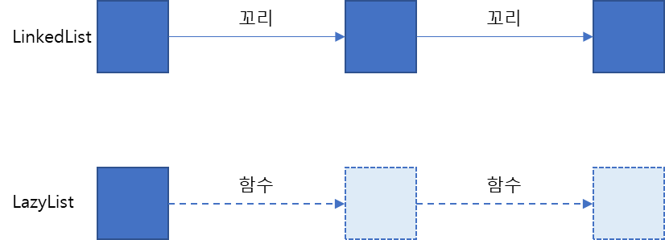

# chapter19. 함수형 프로그래밍 기법


> 조금 더 고급적인 함수형 프로그래밍 기법    
고차원 함수, 커링, 영구 자료구조, 게으른 리스트, 패턴 매칭, 참조 투명성을 이용한 캐싱, 콤비네이터..?
> 

### 고차원 함수

- Comparator.comparing 처럼 다음 중 하나 이상의 동작을 수행하는 함수를 고차원 함수라 함
    - 하나 이상의 함수를 인수로 받음
    - 함수를 결과로 반환
- 스트림 연산과 같이 인수로 전달된 함수가 부작용을 포함할 가능성 염두

### 커링

- 함수를 모듈화하고 코드를 재사용하는데 도움을 주는 커링
- 커링은 x와 y라는 두 인수를 받는 함수 f를 한 개의 인수를 받는 g라는 함수로 대체하는 기법
- 즉, f(x,y) = (g(x))(y)

### 영속 자료구조

- 함수형 프로그램에서 사용되는 자료구조, 데이터베이스에서의 영속과는 다른 의미
- 함수형 메서드에서는 전역 자료구조나 인수로 전달된 구조를 갱신할 수 없음 → 같은 메서드 두 번 호출 시 결과가 달라지며 참조 투명성에 위배
- 예시 코드의 fupdate에서는 인수를 이용해 가능한 많은 정보를 공유(기존 트리를 갱신하지 않고 새로운 노드 생성)
- 이와 같은 함수형 자료구조를 영속이라고 하며 중요한 것은 결과 자료구조를 바꾸지 않는 것

### 스트림과 게으른 평가

- 스트림은 한 번만 소비할 수 있다는 제약이 있어서 재귀적으로 정의할 수 없음
- 소수 스트림 계산 예시에서 4단계 부분에서 최종 연산이 스트림에 호출되어 완전 소비되고 오류 발생
- IntStream.concat은 두 개의 스트림 인스턴스를 인수로 받는데 두 번째 인수가 primes를 재귀호출하게 되며 무한 재귀에 빠짐

→ 해결 위해서 primes를 게으르게 평가



스트림에 일련의 연산을 적용하면 연산이 수행되지 않고 일단 저장, 최종 연산을 적용하는 부분에서만 실제로 연산이 이루어짐

LinkedList의 요소는 메모리에 존재하지만 LazyList의 요소는 Function이 요청해야 생성

```java
// 기본적인 연결 리스트

interface MyList<T> {
  T head();
  
  MyList<T> tail();
  
  dafault boolean isEmpty() {
    return true;
  }
}
  
class MyLinkedList<T> implements MyList<T> {
  private final T head;
  private final MyList<T> tail;
  public MyLinkedList(T head, MyList<T> tail) {
    this.head = head;
    this.tail = tail;
  }
  
  public T head() {
    return head;
  }
    
  public MyList<T> tail() {
    return tail;
  }
    
  public boolean isEmpty() {
    return false;
  }
}
  
class Empty<T> implements MyList<T> {
  public T head() {
    throw new UnSupportedOperationException();
  }
   
  public MyList<T> tail() {
    throw new UnSupportedOperationException();
  }
}

MyList<Integer> I = new MyLinkedList<>(5, new MyLinkedList<>(10, new Empty()));
```

```java
// 기본적인 LazyList
class LazyList<T> implements MyList<T> {
  final T head;
  final Supplier<MyList<T>> tail;
  public MyLinkedList(T head, Supplier<MyList<T>> tail) {
    this.head = head;
    this.tail = tail;
  }    
  public T head() {
    return head;
  }
    
  public MyList<T> tail() {
    return tail.get(); // 위의 head와 달리 tail에서는 Supplier를 인수로 전달받음
  }
    
  public boolean isEmpty() {
    return false;
  }
}

// n으로 시작하는 무한한 LazyList
public static LazyList<Integer> from(int n) {
  return new LazyList<Integer>(n, () -> from(n+1));
}
```

기존처럼 적용하면 컴파일 에러! → 필터 메서드를 정의해서 해결하자

```java
public MyList<T> filter(Predicate<T> p) {
  return isEmpty() ? 
    this : p.test(head()) ?
      new LazyList<>(head(), () -> tail().filter(p)) : tail.filter(p);
}
```

### 패턴 매칭

- 방문자 디자인 패턴
    - 자료형을 언랩할 수 있으며, 특정 데이터 형식을 방문하는 알고리즘을 캡슐화할 수 있음
    - 방문자 클래스는 지정된 데이터 형식의 인스턴스를 입력으로 받고 인스턴스의 모든 멤버에 접근함

```java
class BinOp extends Expr {
  ...
  public Expr accept(SimpiftExprVisitor v) {
    return v.visit(this);
  }
}

public class SimpiftExprVisitor {
   ...
   public Expr visit(BinOp e) {
     if("+".equal(e.opname) && e.right instanceof Number && ...) {
       return e.left;
     }
     return e;
   }
 }
```

- 패턴 매칭의 힘
    - 자바는 패턴 매칭 지원하지 않음 함수형 프로그래밍을 통한 흉내는 가능
    - 스칼라에서는 이미 지원 중

### 캐싱 또는 기억화

- 기억화(memorization)
    - 메서드에 래퍼로 캐시를 추가하는 기법 → 참조 투명성 유지 가능

### ‘같은 객체를 반환함’?

- 참조 투명성은 ‘인수가 같다면 결과도 같아야한다’를 만족함을 의미
- 일반적으로 함수형 프로그래밍에서 데이터가 변경되지 않으므로 같다는 의미는 참조의 ==가 아니라 구조적인 값이 같다는 것

### 콤비네이터

- 함수형 프로그래밍에서는 함수를 인자로 받아 조합해 결과로 함수를 반환하는 고차원 함수를 많이 사용
- 함수를 조합하는 기능을 콤비네이터